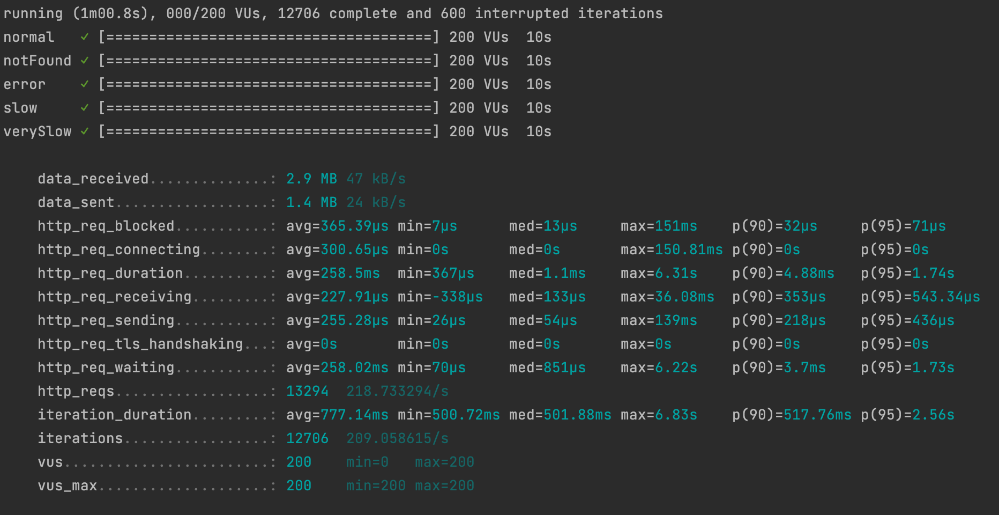
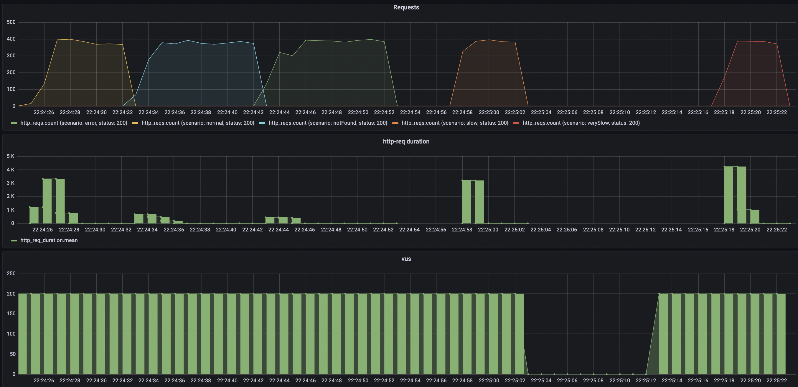
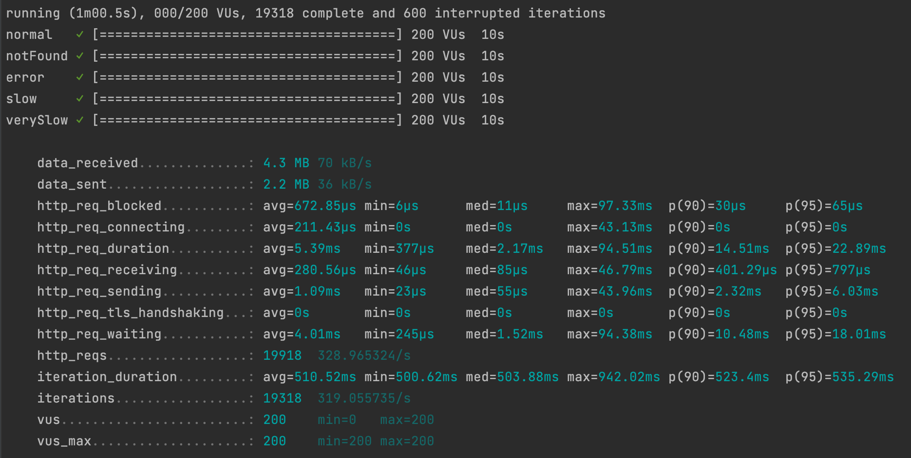
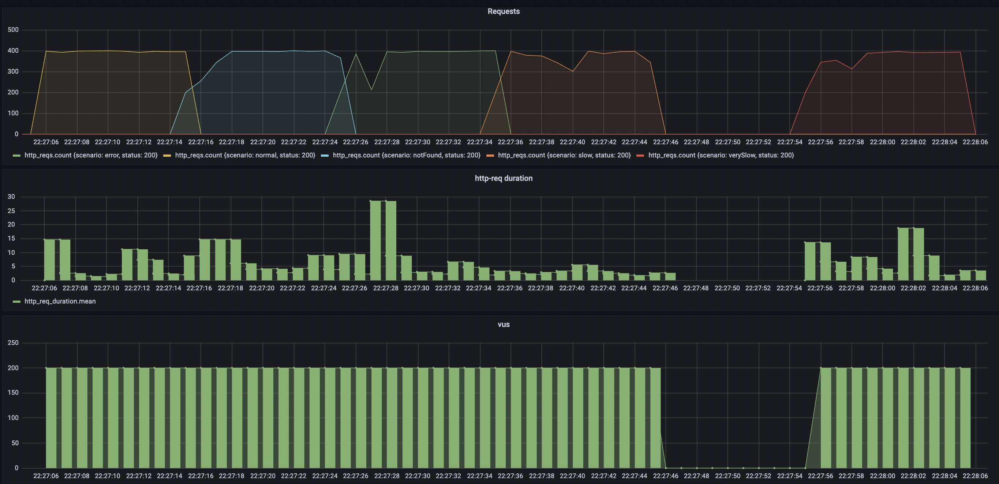

# Tech Challenge

## Resilience

Cache: I added a memory cache to improve times for multiple and similar requests. 

Fallbacks: In case of errors from external services there are different approaches depending on the service.

Timeouts: I set a timeout for the external requests so it does not wait indefinitely until it responds.

## Performance

Reactive approach implemented to optimize times. 
Also the cache, fallbacks and timeouts help to spend less time on successive requests as we can see in the images below:

### First run (cache empty)

### Second run (cached info)

